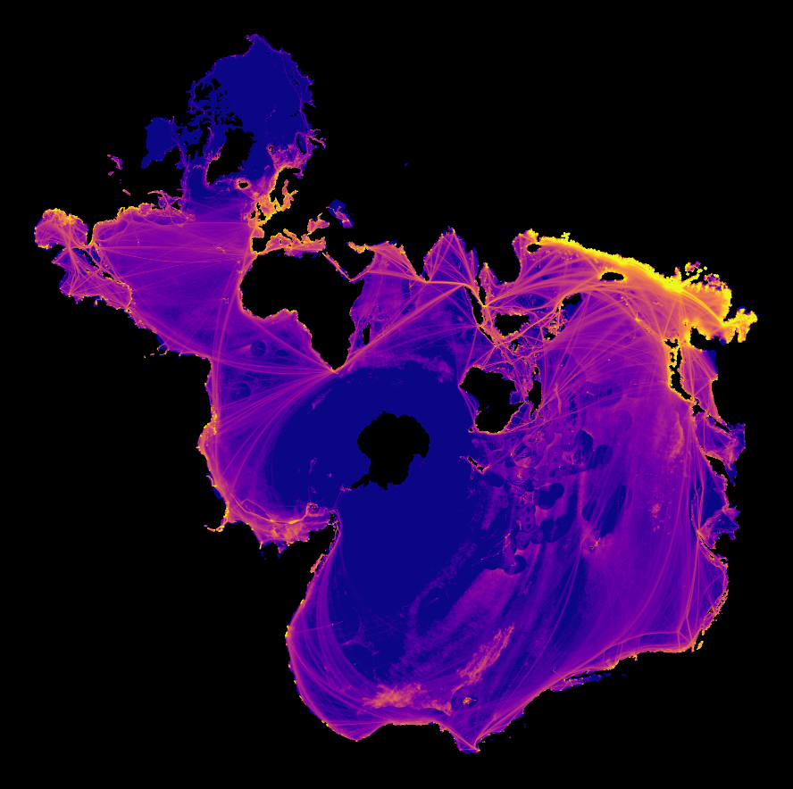
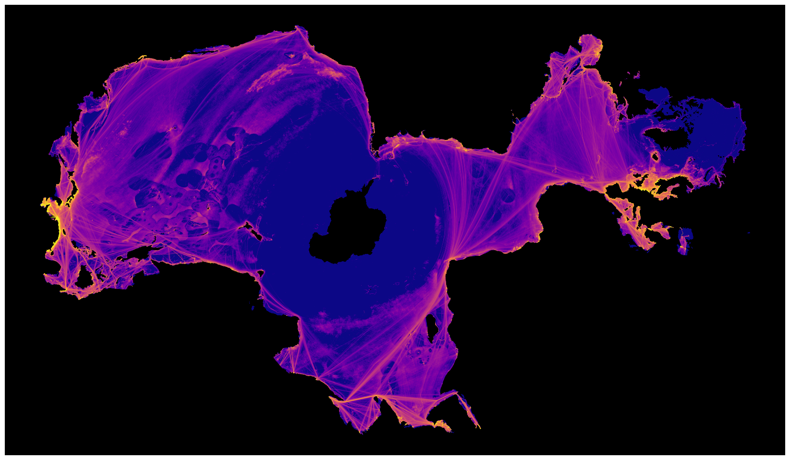
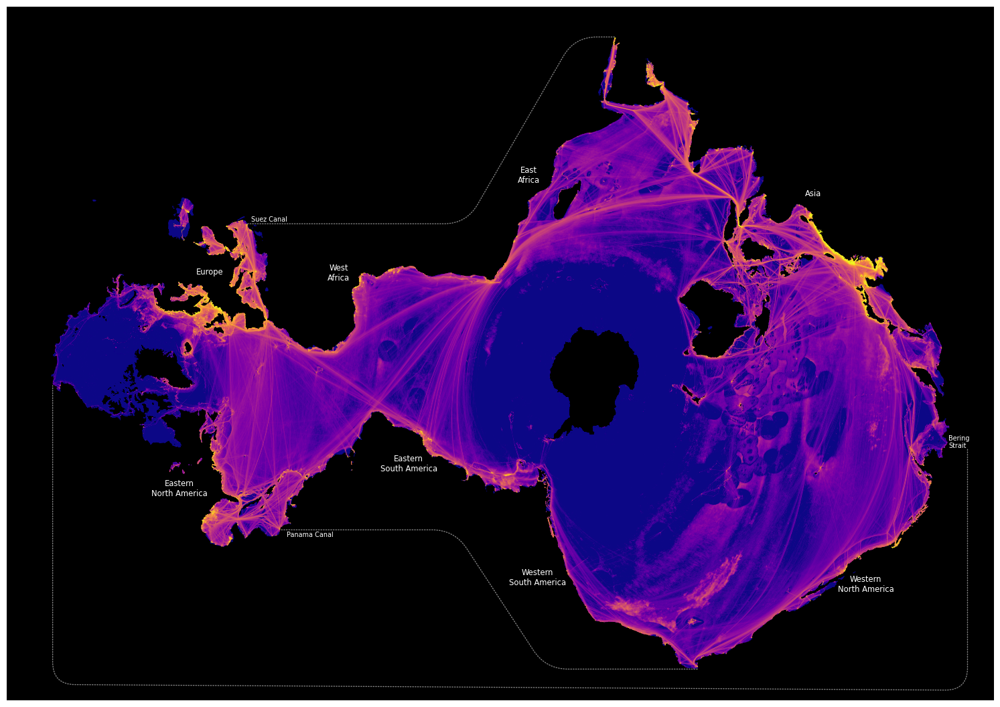

# Ocean Centered Projections

A collection of Ocean centered projections we are experimenting with.

## Data Files

### Shapefiles

### Spilhaus-Adams

    TODO: Provide some links to discussion of history

The main disadvantage of the Spilhaus-Adams projection is that it has
quite large distortion relative to Elastic projections. Most
noticeably, near the coast of China where it greatly inflates the
already large vessel presence there. 

An example of plotting with the Spilhaus projection is located in this
[repo](https://github.com/GlobalFishingWatch/spilhaus). It is not
currently included here because the I didn't want to mix licenses.

## Projections

### Elastic Projections

    TODO: add link to blog and basic info

If you want overlays on the Elastic plots you'll need to download shapefiles
from [Natural Earth](https://www.naturalearthdata.com/downloads/) and place
them to the `resources/shapefiles/natural_earth` directory. You'll need:
    * Rivers: `ne_50m_rivers_lake_centerlines_scale_rank.zip`
    * Lakes: `ne_110m_lakes.zip`
    * Shoreline: `ne_50m_coastline.zip`

See the [PlotElastic notebook](notebooks/elastic/PlotElastic.ipynb) for examples.

#### Elastic-II

    The Elastic-II projection greatly improves on the distortion present in the Spilhaus-Adams projection, 
    but at the cost of Australia. Australia is disintegrated, cut nearly in half and then smeared along the edge
    of the projection so as to be unrecognizable. In practice, people tend to find this confusing.

#### Elastic-X (aka Ozone?)

    TODO: discuss choices a bit

## Licensing

All code in this repository is licensed under Apache-2.0.
