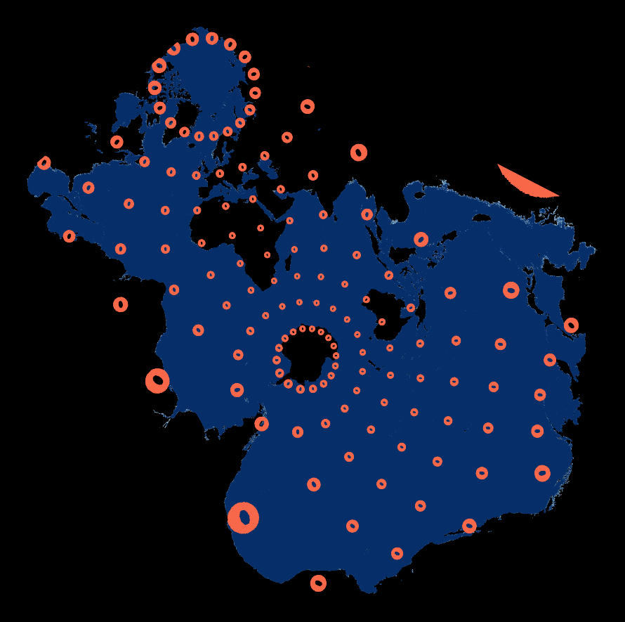
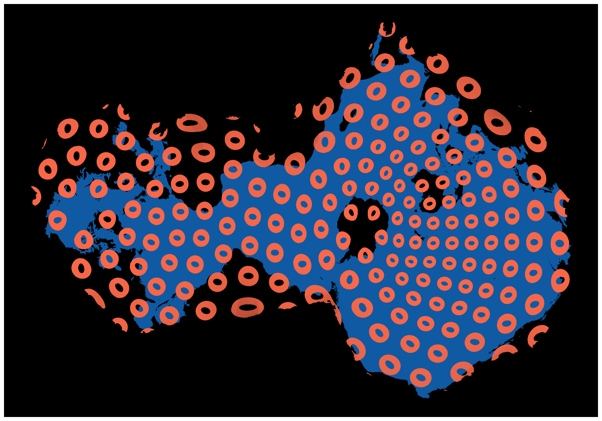
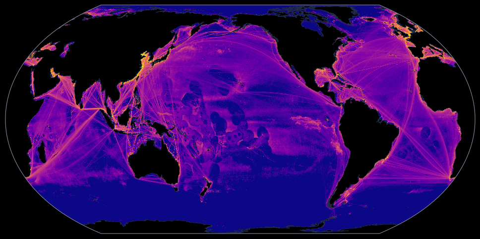
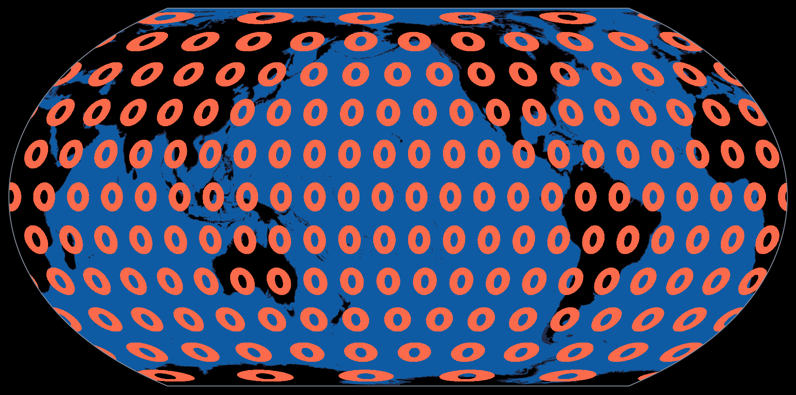

# Ocean Centered Projections

A collection of Ocean centered projections we are experimenting with.

# TODO: add distortion plots for all three projections

## Data

You can download some sample data from Global Fishing Watch following the 
steps shown in [notebooks/data/Download.ipynb](notebooks/data/Download.ipynb).
This data will produce plots that are similar, but not identical to those
shown below.

If you want overlays on the Elastic plots described below you'll need to
download shapefiles from [Natural Earth] (https://www.naturalearthdata.com/downloads/) 
and place them to the `resources/shapefiles/natural_earth` directory.
You'll need:

* Rivers: `ne_50m_rivers_lake_centerlines_scale_rank.zip`
* Lakes: `ne_110m_lakes.zip`
* Shoreline: `ne_50m_coastline.zip`

## Projections

### Spilhaus-Adams

    
    

    TODO: Provide some links to discussion of history

The main disadvantage of the Spilhaus-Adams projection is that it has
quite large distortion relative to Elastic projections. Most
noticeably, near the coast of China where it greatly inflates the
already large vessel presence there. 

An example of plotting with the Spilhaus projection is located in this
[repo](https://github.com/GlobalFishingWatch/spilhaus). It is not
included here because the I didn't want to mix licenses.

### Elastic Projections

The 
[Elastic projections](https://kunimune.blog/2023/12/29/introducing-the-elastic-projections/)
are a family of map projections developed by Justin Kunimune. These
projections include one meant for mapping the oceans (`Elastic-II`) and
more importantly their [repo](https://github.com/jkunimune/elastik) 
includes with a toolkit for creating new projections by specifying where
to cut the globe and how to weight different regions when attempting to
minimize distortion.

See the [PlotElastic notebook](notebooks/elastic/PlotElastic.ipynb) for
some examples of how to plot data in Elastic projections.

#### Elastic-II

    
    

The Elastic-II projection greatly improves on the distortion present in
the Spilhaus-Adams projection, but at the cost of Australia. Australia
is disintegrated–cut nearly in half and then smeared along the edge of
the projection so as to be unrecognizable. In practice, people tend to
find this confusing.

#### Elastic-X (aka Ozone?)

    
    

    TODO: discuss choices a bit

### EqualEarth

    
    

Finally, for comparison, here's the same data in EqualEarth, the global
projection we typically use. This has the large advantage of
familiarity and most users can immediately interpret what, or at least
where, they are looking at. However, it is not as good at showing how
the ocean basins interconnect, you always end up cutting some ocean in
half, and it doesn't do a good job close to the poles.

## Licensing

All code in this repository is licensed under Apache-2.0.
