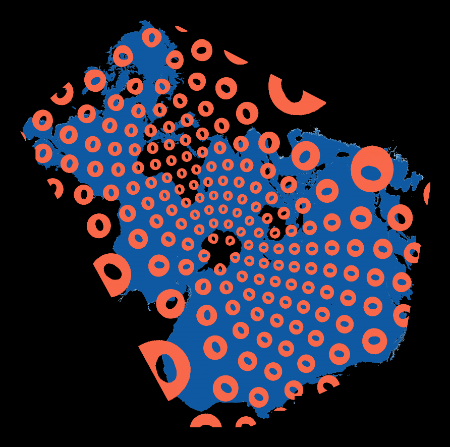
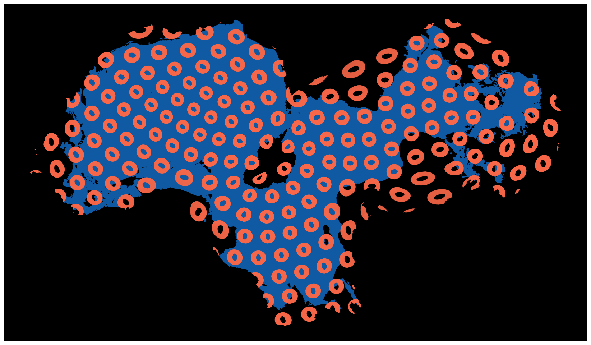
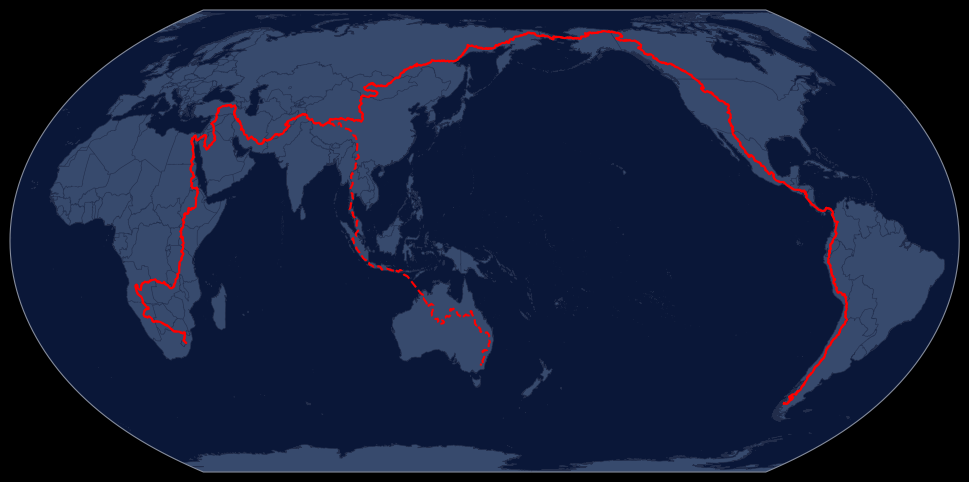
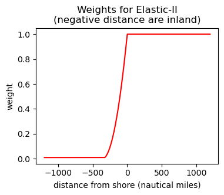
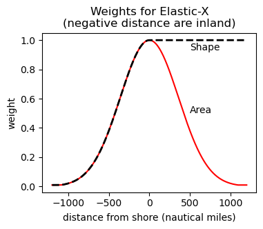

# Ocean Centered Projections

A collection of Ocean centered projections we are experimenting with.

# TODO: add distortion plots for all three projections

## Data

You can download some sample data from Global Fishing Watch following the 
steps shown in [notebooks/data/Download.ipynb](notebooks/data/Download.ipynb).
This data will produce plots that are similar, but not identical to those
shown below.

If you want overlays on the Elastic plots described below you'll need to
download shapefiles from [Natural Earth] (https://www.naturalearthdata.com/downloads/) 
and place them to the `resources/shapefiles/natural_earth` directory.
You'll need:

* Rivers: `ne_50m_rivers_lake_centerlines_scale_rank.zip`
* Lakes: `ne_110m_lakes.zip`
* Shoreline: `ne_50m_coastline.zip`

## Projections

### Spilhaus-Adams

    
    

For some discussion of the history of the Spilhaus-Adams projection
see [here](https://storymaps.arcgis.com/stories/756bcae18d304a1eac140f19f4d5cb3d)
and [here](https://blog.map-projections.net/spilhaus-projections-a-quintet-of-world-ocean-maps).

The main disadvantage of the Spilhaus-Adams projection is that it has
quite large distortion relative to Elastic projections. Most
noticeably, near the coast of China where it greatly inflates the
already large vessel presence there. 

An example of plotting with the Spilhaus projection is located in this
[repo](https://github.com/GlobalFishingWatch/spilhaus). It is not
included here because the I didn't want to mix licenses.

### Elastic Projections

The 
[Elastic projections](https://kunimune.blog/2023/12/29/introducing-the-elastic-projections/)
are a family of map projections developed by Justin Kunimune. These
projections include one meant for mapping the oceans (`Elastic-II`) and
more importantly their [repo](https://github.com/jkunimune/elastik) 
includes with a toolkit for creating new projections by specifying where
to cut the globe and how to weight different regions when attempting to
minimize distortion.

See the [PlotElastic notebook](notebooks/elastic/PlotElastic.ipynb) for
some examples of how to plot data in Elastic projections.

#### Elastic-II

    
    

The Elastic-II projection greatly improves on the distortion present in
the Spilhaus-Adams projection, but at the cost of Australia and
portions of Indonesia. Australia, Sumatra and Java are
disintegrated–cut nearly in half and then smeared along the edge of the
projection so as to be unrecognizable. In practice, people tend to find
this confusing.

#### Elastic-X

    
    

We're currently calling this Elastic-X as a placeholder. We hope to come
up with a more descriptive name for it at some point.

This is closely related to Elastic-II, but we've made two changes to
make it more suitable for our use cases.

1. Shorten the cut that runs through Thailand. In Elastic-II this
   continues down into Australia, see central red line below, which is why
   Australia and parts of Indonesia get disintegrated, but here we
   truncate it in Thailand, see solid portion of red line below, which
   preserves Australia and Indonesia at the cost of causing some
   additional distortion on the ocean.

   

       
   

2. Change the weighting functions. In Elastic-II, the open ocean and a
   small strip along the coast are weighted highly while inland regions
   are down-weighted. See below, left.

   In Elastic-X, for shape distortion, we use a similar weighting scheme 
   as used in Elastic-II, where we weight the oceans high and inland low.
   However, for the area distortion we weight the areas near the shore, both
   inland and at sea, high and everything else low. We also broaden transition
   region in both cases. See below, right.

   The results in less distortion near the shore and more on the high
   seas than we get if we use the same weighting scheme as Elastic-II
   but with this set of cuts. Since the majority of ocean activity
   occurs near shore, this seems like a good trade off. It also results
   in less distortion of Australia and Antarctica which makes it
   somewhat easier interpret the map.

   

       
       
   

### EqualEarth

    
    

Finally, for comparison, here's the same data in EqualEarth, the global
projection we typically use. This has the large advantage of
familiarity and most users can immediately interpret what, or at least
where, they are looking at. However, it is not as good at showing how
the ocean basins interconnect, you always end up cutting some ocean in
half, and it doesn't do a good job close to the poles.

## Licensing

All code in this repository is licensed under Apache-2.0.
